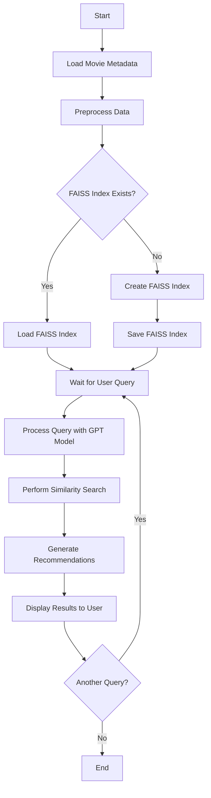

# Movie Recommendation System

This project implements a movie recommendation system using natural language processing and similarity search. It utilizes a pre-trained language model and FAISS (Facebook AI Similarity Search) to provide movie suggestions based on user queries.

## Flow Chart



## Features

- Load and preprocess movie metadata
- Create and save FAISS index for efficient similarity search
- Use LangChain and OpenAI's GPT model for natural language understanding
- Provide movie recommendations based on user queries
- Perform similarity search to find movies similar to the user's request

## Prerequisites

Before running this project, make sure you have the following installed:

- Python 3.7+
- pandas
- numpy
- transformers
- torch
- faiss-cpu (or faiss-gpu for GPU support)
- langchain
- openai

You also need to set up an OpenAI API key as an environment variable.

## Installation

1. Clone this repository:

   ```
   git clone https://github.com/yourusername/movie-recommendation-system.git
   cd movie-recommendation-system
   ```

2. Install the required packages:

   ```
   pip install -r requirements.txt
   ```

3. Set up your OpenAI API key as an environment variable:

   ```
   export OPENAI_API_KEY='your-api-key-here'
   ```

## Usage

1. Prepare your data:
   - Ensure you have the `movies_metadata.csv` file in the project directory.

2. Run the main script:

   ```
   python main.py
   ```

3. The script will load and preprocess the data, create or load a FAISS index, and then prompt you for movie queries.

## Example

```python
query = "I'm looking for an animated action movie. What could you suggest to me?"
result = qa_chain({"query": query})
print(f"\nQuery: {query}")
print(f"Answer: {result['result']}")

# Similarity search example
print("\nTop 3 similar movies:")
docs = docsearch.similarity_search(query, k=3)
for doc in docs:
    print(f"Title: {doc.metadata['title']}")
    print(f"Genres: {doc.metadata['genres']}")
    print(f"Rating: {doc.metadata['rating']}")
    print(f"Content: {doc.page_content[:100]}...")  # Truncated for brevity
```

## Project Structure

- `main.py`: The main script that runs the movie recommendation system
- `movies_metadata.csv`: The dataset containing movie information (available at https://www.kaggle.com/datasets/rounakbanik/the-movies-dataset)
- `faiss_movie_index.pkl`: The FAISS index file (created after first run)

## Contributing

Contributions are welcome! Please feel free to submit a Pull Request.

## License

This project is licensed under the MIT License - see the LICENSE file for details.

## Acknowledgments

- OpenAI for providing the GPT model
- Facebook Research for FAISS
- The creators of LangChain for their excellent library
